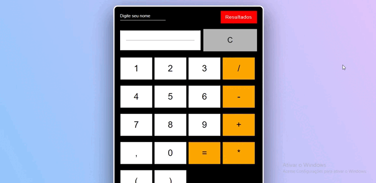

<h1 align="center">🚀 fullstack Calculator App</h1>

<h2 align="center">👁‍🗨👁‍🗨</h2>
<h3 align="center">📸Screenshot</h3>
<p>
<h1 align="center"></h1>

## Sobre o Projeto 📋
Aplicação fullstack, app de uma calculadora. O frontend foi desenvolvido com HTML e CSS, backend com Nodejs, banco de dados MariaDb.

* `Pincipais bibliotecas utilizadas no backend`
    * [express](https://www.npmjs.com/package/express)
    * [mariadb](https://www.npmjs.com/package/mariadb)
    * [sequelize](https://sequelize.org/)

* `Pincipais bibliotecas utilizadas no frontend`
    * [jquery](https://jquery.com/)
    
---
<h2 align="center">Teste o Projeto 💻</h2>
<h4 align="center">Siga todos os passos abaixo para testar o projeto.</h4>
<br>
<br>


### `1 - Git clone`

* Faça o clone do repositório com o git bash utilizando a linha de comando abaixo, ou faça o Download ZIP no botão verde la em cima acima.
```
git clone https://github.com/AAndersonSantos/Fullstack-Calculator-App.git
```

### `2- Backend`
* Entre na pasta `backend` e utilize a linha de comando abaixo para fazer o download de todas as dependências necessárias para que o projeto funcione corretamente
``` 
npm install
``` 
### `3 - Crie a base de dados`
* Na pasta raiz do projeto existe uma pasta sql, nessa pasta contém um arquivo mariadb.sql nesse arquivo tem todos os passos para criar a base de dados e a tabela, entre em seu banco de dados [mariadb](https://mariadb.org/) e execute cada passo sql para que sua base de dados seja criada.  

### `4 - Variáveis de ambiente`
* Crie um arquivo com nome .env na pasta backend, no arquivo .env crie as variáveis de ambiente e atribua os valores necessários para que todo o projeto funcione corretamente. O arquivo .env.example na pasta backend é um exemplo de quais variáveis serão necessárias e quais os valores devem ser atribuídos.

### `5 - Inicie o backend`
* Após realizar todas as configurações necessárias entre na pasta backend e execute o comando `npm start` o backend vai iniciar na porta que você atribuiu a variável SERVER_PORT no arquivo .env  ou na porta 8080.
---

<h3 align="center">Criado por🤖Anderson Santos</h3>